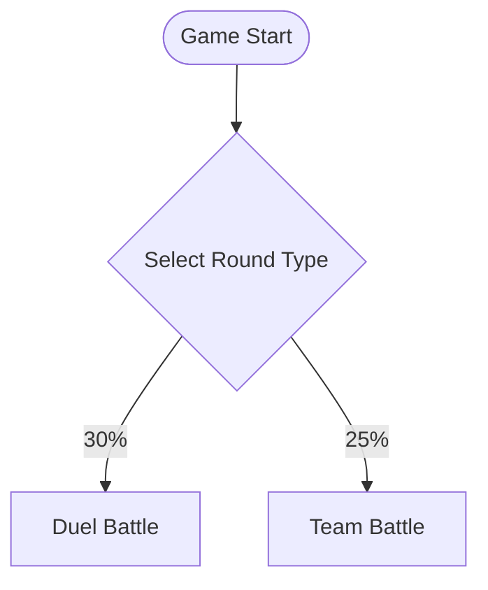
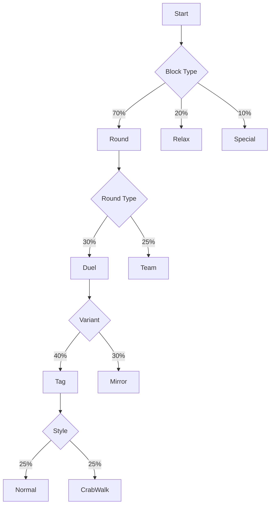

# Chart-to-Gameplay Translation

*This document explains the Mermaid-driven design system.*

## Overview

The Chart-to-Gameplay Translation system is the bridge between visual game design and executable gameplay. Designers create and modify game flow using Mermaid flowcharts - a familiar, visual format - and the system automatically translates these charts into the data structures that drive actual gameplay. This approach makes game design accessible, version-controllable, and immediately testable.

## The Power of Visual Design

### Why Mermaid?

Mermaid offers unique advantages for game design:

**Visual Clarity:**
- See the entire game structure at a glance
- Understand relationships between options
- Spot imbalances or gaps immediately
- Share designs with non-programmers

**Version Control Friendly:**
- Plain text format works with Git
- See exactly what changed in commits
- Merge conflicts are readable
- Review game design changes in PRs

**Living Documentation:**
- The chart IS the game, not just docs
- No synchronization needed
- Always up-to-date
- Self-documenting

**Rapid Iteration:**
- Change a weight, test immediately
- Add new variants in seconds
- Reorder flows visually
- No code compilation needed

### Design-First Development

The Mermaid approach inverts traditional game development:

**Traditional:** Code → Test → Document
**Mermaid:** Design → Auto-Generate → Play

This means:
- Designers can work independently
- Ideas can be tested immediately
- Documentation comes first, not last
- The gap between idea and implementation vanishes

## Mermaid Syntax Extensions

### Standard Mermaid Elements

We use standard flowchart syntax as our foundation:



**Node Types:**
- `[Rectangle]` - Standard nodes
- `{Diamond}` - Decision points
- `([Rounded])` - Start/End states
- `[[Subroutine]]` - Reusable sections

**Edges:**
- `-->` - Standard flow
- `-->|text|` - Labeled transitions
- `-->|weight%|` - Weighted random selection

### Enhanced Syntax for Games

We extend Mermaid with game-specific patterns:

**Multi-line Nodes with Metadata:**
```mermaid
Tag[Tag Duel<br/>One chases, one runs<br/>@duration:90<br/>@players:1v1<br/>@intensity:high]
```

Format:
- Line 1: Display name
- Line 2: Description
- Line 3+: Metadata tags

**Script Blocks:**
```mermaid
TagDuel -->|script| TagScript{{
  "intro": "Time for a TAG DUEL!",
  "setup": "{player1}, you're IT!",
  "rules": "Tag {player2} to win!",
  "countdown": "3... 2... 1... GO!"
}}
```

**Weight Groups:**
```mermaid
%% Define weight group
Variants -->|weights| VariantWeights{{
  "normal": 25,
  "crabWalk": 25,
  "hop": 25,
  "backwards": 15,
  "slowMotion": 10
}}
```

**Conditional Flows:**
```mermaid
TeamSize{Team Size?}
TeamSize -->|< 4 players| SmallTeamVariants
TeamSize -->|>= 4 players| LargeTeamVariants
```

## Translation Process

### Phase 1: Parsing

The Mermaid parser extracts structured data:

```javascript
// Input: Mermaid text
const mermaidText = fs.readFileSync('game-flow.mermaid.md');

// Parse into intermediate representation
const parseResult = {
  nodes: {
    'RoundSelect': {
      type: 'decision',
      text: 'Select Round Type'
    },
    'Duel': {
      type: 'node',
      text: 'Duel Battle',
      metadata: { intensity: 'high' }
    }
  },
  edges: [
    {
      from: 'RoundSelect',
      to: 'Duel',
      weight: 30,
      label: '30%'
    }
  ],
  scripts: {
    'TagScript': { 
      intro: "Time for a TAG DUEL!",
      // ...
    }
  }
}
```

### Phase 2: Structure Building

The parser output is transformed into game structures:

```javascript
// Build hierarchical game flow
const gameFlow = {
  roundTypes: {
    duel: {
      weight: 30,
      name: "Duel Battle",
      metadata: { intensity: 'high' },
      variants: {
        tag: {
          weight: 40,
          name: "Tag Duel",
          duration: 90,
          // ...
        }
      }
    }
  }
}
```

### Phase 3: Weight Normalization

Ensure weights sum correctly:

```javascript
// If weights don't sum to 100, normalize
function normalizeWeights(items) {
  const sum = items.reduce((acc, item) => acc + item.weight, 0);
  if (sum !== 100) {
    items.forEach(item => {
      item.weight = (item.weight / sum) * 100;
    });
  }
}
```

### Phase 4: Validation

Check for common issues:
- Missing scripts for nodes
- Unreachable nodes
- Invalid metadata
- Weight imbalances
- Circular dependencies

### Phase 5: Runtime Integration

The processed structure integrates with the game engine:

```javascript
// Game engine uses the parsed structure
class GameEngine {
  constructor(mermaidFile) {
    this.gameFlow = parseMermaidFile(mermaidFile);
  }
  
  selectNextRound() {
    return weightedSelect(this.gameFlow.roundTypes);
  }
}
```

## Advanced Patterns

### Nested Flows

Mermaid can represent multi-level selection:



### Shared Definitions

Reuse common elements:

```mermaid
flowchart TD
    %% Define shared modifiers
    Modifiers[Shared Modifiers]
    Modifiers --> Blindfold[Blindfold<br/>@weight:15]
    Modifiers --> TeamChant[Team Chant<br/>@weight:10]
    
    %% Multiple variants can use shared modifiers
    TagDuel -.-> Modifiers
    MirrorDuel -.-> Modifiers
```

### Dynamic Weights

Weights can reference conditions:

```mermaid
Energy{Energy Level}
Energy -->|high| HighEnergyWeights{{
  "duel": 40,
  "team": 30,
  "ffa": 30
}}
Energy -->|low| LowEnergyWeights{{
  "duel": 20,
  "team": 30,
  "relief": 50
}}
```

## Implementation Architecture

### File Structure
```
/src/games/simon-says/
├── game-flow.mermaid.md       # Source of truth
├── design-documentation/       # These docs
├── mechanics/
│   ├── mermaidParser.js       # Parsing logic
│   ├── gameFlowBuilder.js     # Structure building
│   └── flowEngine.js          # Runtime engine
```

### Hot Reload Workflow

1. Developer edits `game-flow.mermaid.md`
2. File watcher detects change
3. Parser re-processes the file
4. Game structure updates in memory
5. Next selection uses new weights
6. No restart required!

### Error Handling

The system gracefully handles chart errors:

```javascript
try {
  const flow = parseMermaid(content);
  validateFlow(flow);
  return flow;
} catch (error) {
  console.error('Mermaid parse error:', error);
  // Fall back to last valid version
  return lastValidFlow;
}
```

## Best Practices

### Chart Organization

**Use Clear Hierarchies:**
- Block Type → Round Type → Variant → Sub-variant → Modifier
- Keep levels consistent
- Group related nodes

**Meaningful Names:**
- Node IDs: `TagDuel`, `CrabWalkTag`
- Display names: "Tag Duel", "Crab Walk Tag"
- Descriptions: Brief and clear

**Weight Guidelines:**
- Common: 20-40%
- Occasional: 10-20%
- Rare: 5-10%
- Very Rare: 1-5%

### Metadata Standards

**Required Metadata:**
- `@duration`: Time in seconds
- `@players`: Participation format
- `@intensity`: low/medium/high

**Optional Metadata:**
- `@minPlayers`: Minimum required
- `@maxPlayers`: Maximum allowed
- `@space`: indoor/outdoor/any
- `@equipment`: Required items

### Script Formatting

**Consistent Script Keys:**
- `intro`: Announce the activity
- `setup`: Get players ready
- `rules`: Explain how to play
- `start`: Begin the action
- `during`: Mid-activity callouts
- `ending`: Conclude the activity

**Token Usage:**
- `{player1}`, `{player2}`: Player names
- `{team1}`, `{team2}`: Team names
- `[pause]`: Pause tokens
- `{variant}`: Current variant name

## Debugging Tools

### Visualization
The Mermaid chart itself is the primary debugging tool - you can see the entire flow and spot issues visually.

### Parse Output
Log the parsed structure to verify correct interpretation:

```javascript
console.log(JSON.stringify(parsedFlow, null, 2));
```

### Weight Analysis
Check weight distribution:

```javascript
function analyzeWeights(flow) {
  console.log('Round Type Distribution:');
  Object.entries(flow.roundTypes).forEach(([type, config]) => {
    console.log(`  ${type}: ${config.weight}%`);
  });
}
```

### Simulation
Run many selections to verify distribution:

```javascript
function simulateSelections(flow, count = 1000) {
  const results = {};
  for (let i = 0; i < count; i++) {
    const selected = weightedSelect(flow.roundTypes);
    results[selected.id] = (results[selected.id] || 0) + 1;
  }
  return results;
}
```

## Future Enhancements

### Visual Editor
- Drag-and-drop Mermaid editing
- Live preview of changes
- Weight adjustment sliders
- Built-in validation

### Advanced Syntax
- Variables: `$defaultDuration = 90`
- Includes: `include common-modifiers.mmd`
- Conditionals: `if playerCount > 20`
- Loops: Generate similar variants

### Analytics Integration
- Track actual vs. expected selection rates
- Identify never-selected paths
- Suggest weight adjustments
- A/B test different flows

The Chart-to-Gameplay system makes Simon Says infinitely customizable while keeping the design process visual, intuitive, and fun. Game designers can focus on creating engaging experiences while the system handles the technical translation seamlessly.