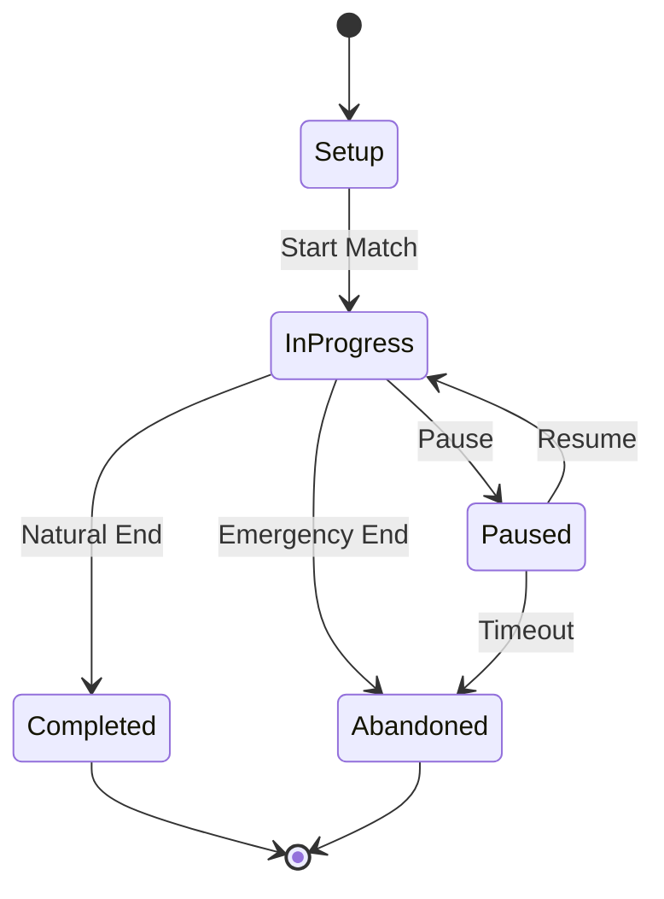

# State Management

*This document covers how the system tracks and manages game state.*

## Overview

State management in Simon Says handles the complex task of tracking everything happening in a dynamic, real-world game. Unlike digital games where players are always present and connected, Simon Says must gracefully handle players joining late, leaving early, taking breaks, and even technical interruptions. The state system is designed to be resilient, flexible, and always recoverable.

### Critical Constraint: One-Way Communication

**Simon operates with one-way communication only**. The system can output audio instructions but receives no feedback about game outcomes, player performance, or real-world events. This fundamentally shapes what state can be tracked:

**What Simon CANNOT track:**
- Round winners or scores
- Player exhaustion or engagement
- Whether instructions were followed
- Completion status of activities
- Injuries or player issues
- Actual vs intended gameplay

**What Simon CAN track:**
- Initial player roster
- Players who explicitly leave (via app)
- Time elapsed
- Pre-selected activity sequence
- What has been announced

This constraint means state management focuses on **orchestration state** (what should happen) rather than **game state** (what did happen). The humans handle all game state tracking.

## Match State

The Match State is the central source of truth for the entire game session:

### Core Match Properties

```javascript
matchState = {
  // Identity
  id: "match_2024_01_15_14_30",
  startTime: "2024-01-15T14:30:00Z",
  location: "Riverside Park",
  
  // Progress
  status: "in_progress", // setup, in_progress, completed, abandoned
  currentBlockIndex: 4,
  currentBlockType: "round",
  totalBlocksPlayed: 4,
  
  // Timing
  elapsedTime: 845, // seconds
  estimatedTimeRemaining: 1255, // seconds
  lastBlockStartTime: "2024-01-15T14:42:00Z",
  
  // Configuration
  config: {
    targetDuration: 1800, // 30 minutes
    difficultyLevel: "medium",
    maxRounds: 10,
    pauseMultiplier: 1.0
  }
}
```

### Block History

Complete record of all blocks played:

```javascript
blockHistory: [
  {
    index: 0,
    type: "ceremony",
    subtype: "opening",
    startTime: "14:30:00",
    duration: 240,
    participants: ["all"]
  },
  {
    index: 1,
    type: "round",
    play: {
      roundType: "duel",
      variant: "tag",
      subVariant: "normal",
      players: { 
        player1: "Alice",
        player2: "Bob"
      }
    },
    startTime: "14:34:00",
    duration: 120,
    outcome: "completed"
  },
  // ... more blocks
]
```

### Current Block State

Detailed state of the active block:

```javascript
currentBlock: {
  type: "round",
  phase: "in_progress", // setup, explanation, in_progress, ending
  startTime: "14:42:00",
  elapsedTime: 45,
  
  play: {
    // Full Play object as selected
    roundType: "team",
    variant: "relay",
    // ...
  },
  
  scriptProgress: {
    currentScript: "during",
    scriptsCompleted: ["intro", "setup", "rules", "start"],
    lastSpokenAt: "14:42:45"
  }
}
```

### Difficulty Tracking

```javascript
difficultyTracking: {
  currentDifficulty: 3,
  selectedCurve: "gentle", // gentle, steady, roller_coaster
  roundDifficulties: [1, 1, 2, 3], // History of difficulties played
  
  timingMetrics: {
    roundsSinceLastRelax: 2,
    timeSinceLastRelax: 480, // seconds
    averageDifficulty: 1.75
  }
}
```

## Player States

Players are dynamic entities that can join, leave, and return:

### Individual Player State

```javascript
players: {
  "alice_uuid": {
    // Identity
    name: "Alice",
    id: "alice_uuid",
    joinedAt: "14:30:00",
    
    // Team Assignment
    team: "red",
    teamRole: "player", // player, captain, cheerleader
    
    // Participation
    status: "active", // active, break, departed
    lastActiveTime: "14:42:00",
    
    // Selection tracking
    stats: {
      timesSelected: 2,
      lastSelectedRound: 3,
      roundsSinceSelected: 0,
      totalActiveTime: 720, // seconds since joining
      recentPartners: ["Bob", "Charlie"],
      recentActivities: ["tag-duel", "mirror-team"]
    }
  }
}
```

### Team State

```javascript
teams: {
  red: {
    name: "Red Rockets",
    color: "#FF0000",
    
    players: ["alice_uuid", "charlie_uuid", "eve_uuid"],
    activePlayers: ["alice_uuid", "charlie_uuid"], // Eve on break
    
    stats: {
      playersSelected: 12, // Total selections from this team
      currentRound: 5,
      teamChant: "Red Rockets Rule!"
    }
  },
  
  blue: {
    name: "Blue Lightning",
    // ...
  }
}
```

### Dynamic Player Management

**Late Arrivals:**
```javascript
function handlePlayerJoin(playerName) {
  const player = {
    name: playerName,
    id: generateUUID(),
    joinedAt: getCurrentTime(),
    status: "active",
    stats: initializeStats(),
    
    // Flag for special handling
    lateArrival: true,
    missedRounds: matchState.currentBlockIndex
  };
  
  // Assign to smaller team
  const team = getTeamWithFewerPlayers();
  player.team = team.id;
  
  // Announce arrival
  queueAnnouncement(`Everyone welcome ${playerName} to ${team.name}!`);
  
  return player;
}
```

**Player Breaks:**
```javascript
function handlePlayerBreak(playerId) {
  players[playerId].status = "break";
  players[playerId].breakStartTime = getCurrentTime();
  
  // Update team active count
  const team = players[playerId].team;
  teams[team].activePlayers = teams[team].activePlayers
    .filter(id => id !== playerId);
  
  // Rebalance if needed
  if (shouldRebalanceTeams()) {
    suggestTemporaryRebalance();
  }
}
```

**Player Returns:**
```javascript
function handlePlayerReturn(playerId) {
  const player = players[playerId];
  player.status = "active";
  
  const breakDuration = getCurrentTime() - player.breakStartTime;
  player.stats.totalBreakTime += breakDuration;
  
  // Re-add to active team
  teams[player.team].activePlayers.push(playerId);
  
  // Gentle re-integration
  player.stats.consecutiveSitOuts = -1; // Priority for next selection
}
```

## State Persistence

### Checkpointing

Regular state snapshots for recovery:

```javascript
checkpoint: {
  frequency: 60, // seconds
  lastCheckpoint: "14:41:00",
  
  save() {
    const snapshot = {
      timestamp: getCurrentTime(),
      matchState: deepClone(matchState),
      players: deepClone(players),
      teams: deepClone(teams),
      version: STATE_VERSION
    };
    
    localStorage.setItem('simon_checkpoint', JSON.stringify(snapshot));
    
    // Also save to cloud if available
    if (cloudStorage.available) {
      cloudStorage.save(`checkpoint_${snapshot.timestamp}`, snapshot);
    }
  }
}
```

### Recovery Mechanisms

```javascript
function recoverFromInterruption() {
  // Try local storage first
  let checkpoint = localStorage.getItem('simon_checkpoint');
  
  if (!checkpoint) {
    // Try cloud storage
    checkpoint = await cloudStorage.getLatest('checkpoint_*');
  }
  
  if (checkpoint) {
    const state = JSON.parse(checkpoint);
    
    // Validate state version
    if (state.version !== STATE_VERSION) {
      state = migrateState(state);
    }
    
    // Restore state
    matchState = state.matchState;
    players = state.players;
    teams = state.teams;
    
    // Resume from last known position
    resumeFromBlock(matchState.currentBlockIndex);
  } else {
    // No checkpoint - graceful degradation
    startFreshWithWarning();
  }
}
```

## State Synchronization

### Multi-Device Considerations

If running on multiple devices (tablet + phone):

```javascript
stateSync: {
  primary: "tablet_001",
  replicas: ["phone_001", "phone_002"],
  
  syncInterval: 5000, // ms
  lastSync: "14:42:00",
  
  broadcast(update) {
    const message = {
      type: "state_update",
      source: deviceId,
      timestamp: getCurrentTime(),
      update: update
    };
    
    webSocket.broadcast(message);
  },
  
  handleRemoteUpdate(message) {
    if (message.source === stateSync.primary) {
      applyUpdate(message.update);
    } else {
      // Only accept from primary unless failover
      logIgnoredUpdate(message);
    }
  }
}
```

## State Transitions

### Valid State Flows



### Transition Guards

```javascript
function canTransitionTo(newStatus) {
  const transitions = {
    setup: ["in_progress", "abandoned"],
    in_progress: ["paused", "completed", "abandoned"],
    paused: ["in_progress", "abandoned"],
    completed: [],
    abandoned: []
  };
  
  return transitions[matchState.status].includes(newStatus);
}
```

## Performance Optimizations

### Selective Updates

Only update what changed:

```javascript
function updatePlayerStat(playerId, statKey, value) {
  // Don't clone entire state
  players[playerId].stats[statKey] = value;
  players[playerId].lastModified = getCurrentTime();
  
  // Mark for next checkpoint
  dirtyFlags.players[playerId] = true;
}
```

### Computed Properties

Calculate on-demand rather than store:

```javascript
// Don't store this
get averageRoundDuration() {
  const rounds = blockHistory.filter(b => b.type === "round");
  return rounds.reduce((sum, r) => sum + r.duration, 0) / rounds.length;
}

// Instead of storing on every round
```

### Memory Management

Clean up old data:

```javascript
function pruneHistory() {
  // Keep last 20 blocks in detail
  if (blockHistory.length > 20) {
    const detailed = blockHistory.slice(-20);
    const summary = summarizeBlocks(blockHistory.slice(0, -20));
    
    blockHistory = [summary, ...detailed];
  }
  
  // Prune old energy readings
  energyTracking.history = energyTracking.history.slice(-50);
}
```

## State Debugging

### State Inspector

```javascript
function inspectState() {
  console.group("Match State");
  console.log("Status:", matchState.status);
  console.log("Current Block:", matchState.currentBlockIndex);
  console.log("Time Elapsed:", formatTime(matchState.elapsedTime));
  console.groupEnd();
  
  console.group("Players");
  console.table(Object.values(players).map(p => ({
    name: p.name,
    team: p.team,
    status: p.status,
    rounds: p.stats.roundsPlayed
  })));
  console.groupEnd();
}
```

### State Validation

```javascript
function validateState() {
  const issues = [];
  
  // Check player counts
  const activeCount = Object.values(players)
    .filter(p => p.status === "active").length;
  if (activeCount < 2) {
    issues.push("Less than 2 active players");
  }
  
  // Check team balance
  const teamSizes = Object.values(teams)
    .map(t => t.activePlayers.length);
  if (Math.max(...teamSizes) - Math.min(...teamSizes) > 3) {
    issues.push("Teams severely imbalanced");
  }
  
  // Check timing
  if (matchState.elapsedTime > matchState.config.targetDuration * 1.5) {
    issues.push("Match significantly overtime");
  }
  
  return issues;
}
```

## Edge Cases

### State Recovery Scenarios

**Power Failure:**
- Restore from last checkpoint
- Skip to next round if mid-round
- Announce brief recap

**App Crash:**
- Auto-save on crash detection
- Restore with warning
- Continue from safe point

**Network Loss:**
- Continue locally
- Queue sync updates
- Reconcile when reconnected

**Device Switch:**
- Export state via QR code
- Import on new device
- Seamless continuation

The state management system ensures that no matter what happens in the physical world - players coming and going, technical issues, or unexpected interruptions - the game can continue smoothly with all progress preserved and all players accounted for.