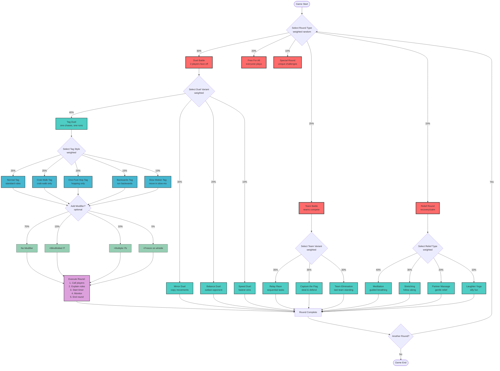

# Simon Says Game Flow - Mermaid Chart

```mermaid
flowchart TD
    Start([Game Start]) --> RoundSelect{Select Round Type<br/>weighted random}
    
    %% Round Types (Level 1)
    RoundSelect -->|30%| DuelBattle[Duel Battle<br/>2 players face off]
    RoundSelect -->|25%| TeamBattle[Team Battle<br/>teams compete]
    RoundSelect -->|20%| FreeForAll[Free For All<br/>everyone plays]
    RoundSelect -->|15%| ReliefRound[Relief Round<br/>recovery/calm]
    RoundSelect -->|10%| SpecialRound[Special Round<br/>unique challenges]
    
    %% Duel Battle Variants (Level 2)
    DuelBattle --> DuelVariant{Select Duel Variant<br/>weighted}
    DuelVariant -->|40%| Tag[Tag Duel<br/>one chases, one runs]
    DuelVariant -->|30%| Mirror[Mirror Duel<br/>copy movements]
    DuelVariant -->|20%| Balance[Balance Duel<br/>outlast opponent]
    DuelVariant -->|10%| Speed[Speed Duel<br/>fastest wins]
    
    %% Tag Variants (Level 3)
    Tag --> TagVariant{Select Tag Style<br/>weighted}
    TagVariant -->|25%| NormalTag[Normal Tag<br/>standard rules]
    TagVariant -->|25%| CrabWalk[Crab Walk Tag<br/>crab walk only]
    TagVariant -->|25%| HopTag[One-Foot Hop Tag<br/>hopping only]
    TagVariant -->|15%| BackwardsTag[Backwards Tag<br/>run backwards]
    TagVariant -->|10%| SlowMotion[Slow Motion Tag<br/>move in slow-mo]
    
    %% Tag Modifiers (Level 4)
    NormalTag --> TagMods{Add Modifier?<br/>optional}
    CrabWalk --> TagMods
    HopTag --> TagMods
    BackwardsTag --> TagMods
    SlowMotion --> TagMods
    
    TagMods -->|70%| NoMod[No Modifier]
    TagMods -->|15%| Blindfold[+Blindfolded IT]
    TagMods -->|10%| MultiIT[+Multiple ITs]
    TagMods -->|5%| Freeze[+Freeze on whistle]
    
    %% Execute Round
    NoMod --> Execute[Execute Round:<br/>1. Call players<br/>2. Explain rules<br/>3. Start timer<br/>4. Monitor<br/>5. End round]
    Blindfold --> Execute
    MultiIT --> Execute
    Freeze --> Execute
    
    %% Team Battle Variants (Level 2)
    TeamBattle --> TeamVariant{Select Team Variant<br/>weighted}
    TeamVariant -->|35%| Relay[Relay Race<br/>sequential tasks]
    TeamVariant -->|35%| Capture[Capture the Flag<br/>steal & defend]
    TeamVariant -->|30%| Elimination[Team Elimination<br/>last team standing]
    
    %% Relief Round Variants (Level 2)
    ReliefRound --> ReliefVariant{Select Relief Type<br/>weighted}
    ReliefVariant -->|40%| Meditation[Meditation<br/>guided breathing]
    ReliefVariant -->|30%| Stretch[Stretching<br/>follow along]
    ReliefVariant -->|20%| Massage[Partner Massage<br/>gentle relief]
    ReliefVariant -->|10%| Laugh[Laughter Yoga<br/>silly fun]
    
    %% All paths eventually lead to round completion
    Execute --> RoundComplete[Round Complete]
    Mirror --> RoundComplete
    Balance --> RoundComplete
    Speed --> RoundComplete
    Relay --> RoundComplete
    Capture --> RoundComplete
    Elimination --> RoundComplete
    Meditation --> RoundComplete
    Stretch --> RoundComplete
    Massage --> RoundComplete
    Laugh --> RoundComplete
    
    %% Continue or End
    RoundComplete --> NextRound{Another Round?}
    NextRound -->|Yes| RoundSelect
    NextRound -->|No| GameEnd([Game End])
    
    %% Styling
    classDef level1 fill:#FF6B6B,stroke:#333,stroke-width:3px
    classDef level2 fill:#4ECDC4,stroke:#333,stroke-width:2px
    classDef level3 fill:#45B7D1,stroke:#333,stroke-width:2px
    classDef level4 fill:#96CEB4,stroke:#333,stroke-width:1px
    classDef execute fill:#DDA0DD,stroke:#333,stroke-width:2px
    
    class DuelBattle,TeamBattle,FreeForAll,ReliefRound,SpecialRound level1
    class Tag,Mirror,Balance,Speed,Relay,Capture,Elimination,Meditation,Stretch,Massage,Laugh level2
    class NormalTag,CrabWalk,HopTag,BackwardsTag,SlowMotion level3
    class NoMod,Blindfold,MultiIT,Freeze level4
    class Execute execute
```